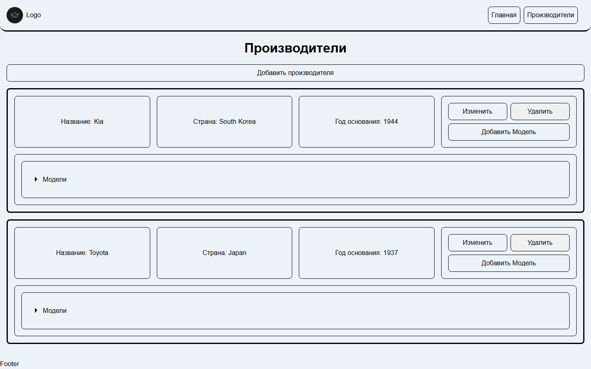

# Auto Market

CRUD-каталог производителей автомобилей и их моделей: REST API на ASP.NET Core плюс Angular-клиент поверх него. Два самостоятельных проекта, сведённые в один репозиторий как `/api` и `/web`, каждый со своей полной историей коммитов.


## Что умеет

- CRUD производителей: название, страна, год основания
- CRUD моделей, привязанных к производителю
- Разворачиваемое дерево «производитель → модели» в интерфейсе
- Валидация и обработка ошибок на уровне API, единая обёртка ответа
- Документация API на Scalar с возможностью отправить запрос прямо из браузера



## Стек

**API:** .NET 10 · ASP.NET Core Web API · EF Core 10 (Npgsql) · PostgreSQL · Scalar (OpenAPI)
**Web:** Angular 18 · TypeScript · SCSS

## Запуск

Нужен PostgreSQL:

```bash
docker run -d --name automarket-pg -e POSTGRES_USER=postgres -e POSTGRES_PASSWORD=postgres -e POSTGRES_DB=AutoMarketDb -p 5432:5432 postgres:16-alpine
```

**API** (`/api/AutoMarket/AutoMarket`) — строка подключения в `appsettings.Development.json` (создайте сами, в репозитории её нет):

```json
{
  "ConnectionStrings": {
    "ApplicationDbContext": "Host=localhost;Database=AutoMarketDb;Username=postgres;Password=postgres"
  }
}
```

```bash
cd api/AutoMarket/AutoMarket
dotnet ef database update
dotnet run --launch-profile https
```

API поднимется на `https://localhost:7141`, документация — на `/scalar/v1`.

**Web** (`/web`):

```bash
cd web
yarn install
yarn start
```

Клиент — на `http://localhost:4200`, API-адрес задан в `src/environments/environment.ts`.

## Статус

Рабочий: оба проекта собираются и запускаются, CRUD проверен вручную через Scalar, curl и сам интерфейс — создание, чтение, обновление, удаление производителей и моделей. Автотестов нет.
