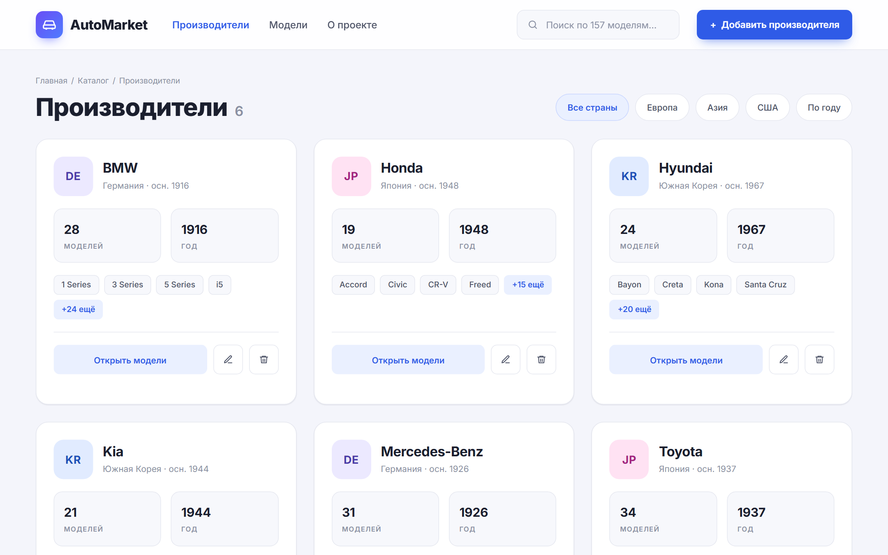
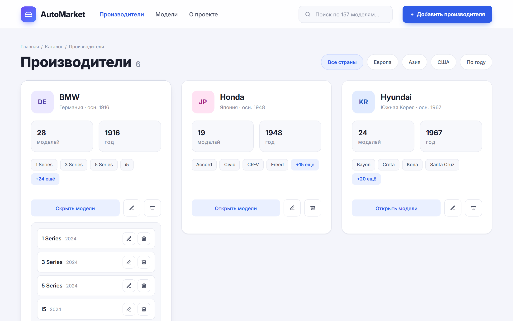
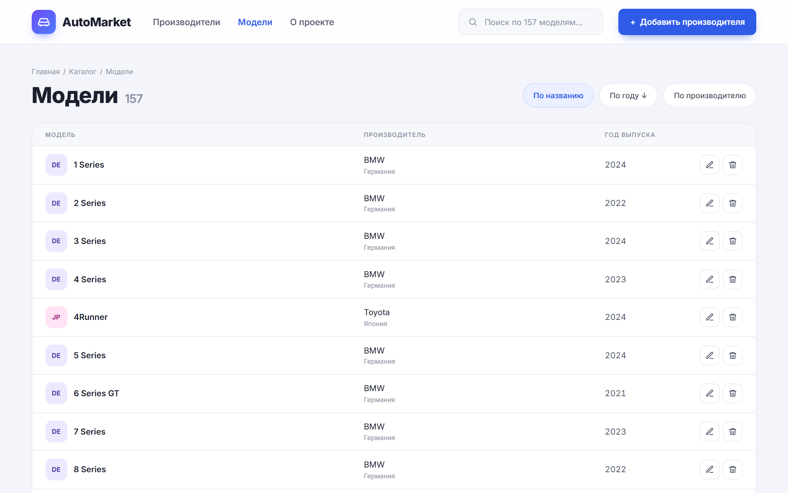
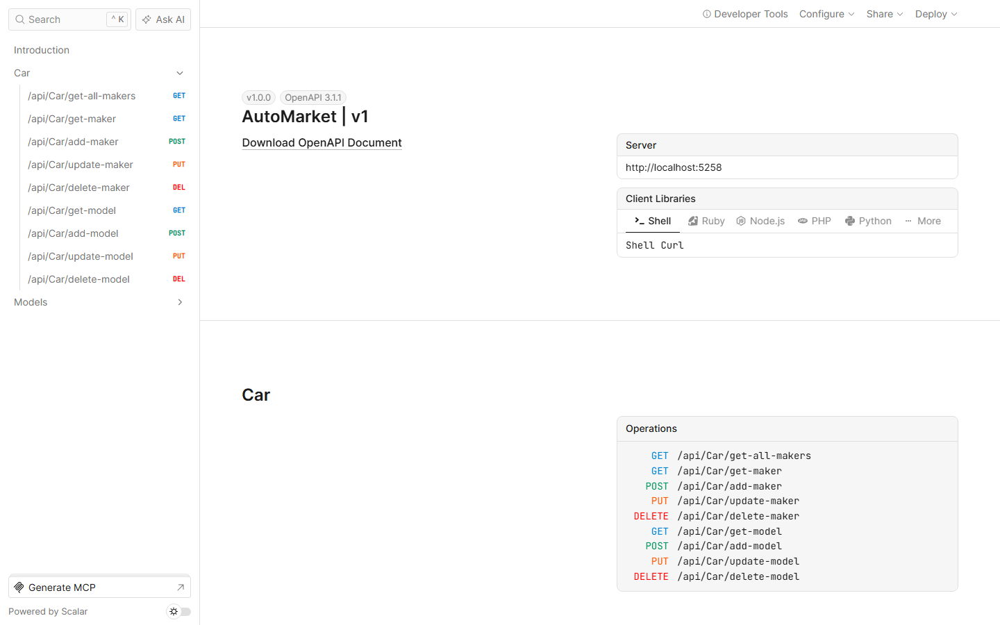
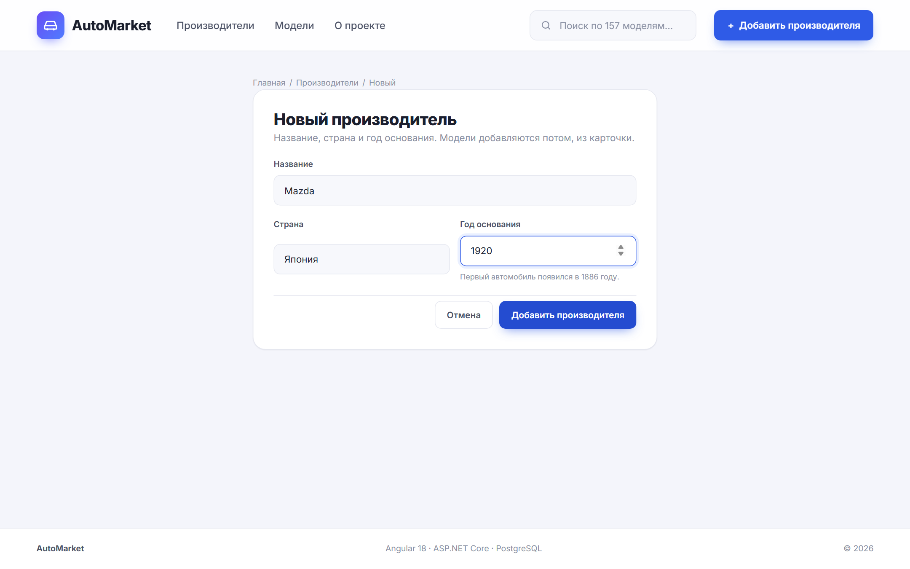

# Auto Market

Каталог производителей автомобилей и их моделей: REST API на ASP.NET Core плюс Angular-клиент поверх него. Два самостоятельных проекта, сведённые в один репозиторий как `/api` и `/web`, каждый со своей полной историей коммитов.



## Что умеет

- Карточки производителей: страна, год основания, число моделей, превью модельного ряда
- Раскрытие моделей прямо в карточке, редактирование и удаление в один клик
- Отдельная таблица всех моделей с сортировкой по названию, году и производителю
- Мгновенный поиск по производителям и моделям, фильтр по регионам, сортировка по году основания
- CRUD производителей и моделей с валидацией на клиенте и на API
- Единая обёртка ответов API и документация на Scalar с отправкой запросов из браузера





## Стек

**API:** .NET 10 · ASP.NET Core Web API · EF Core 10 (Npgsql) · PostgreSQL · Scalar (OpenAPI)
**Web:** Angular 18 (standalone-компоненты, signals) · TypeScript · Reactive Forms · SCSS

## Запуск

Нужен PostgreSQL:

```bash
docker run -d --name automarket-pg -e POSTGRES_USER=postgres -e POSTGRES_PASSWORD=postgres -e POSTGRES_DB=AutoMarketDb -p 5432:5432 postgres:16-alpine
```

**API** (`/api/AutoMarket/AutoMarket`) — строка подключения в `appsettings.Development.json` (создайте сами, в репозитории её нет):

```json
{
  "ConnectionStrings": {
    "ApplicationDbContext": "Host=localhost;Database=AutoMarketDb;Username=postgres;Password=postgres"
  }
}
```

```bash
cd api/AutoMarket/AutoMarket
dotnet ef database update
dotnet run --launch-profile https
```

API поднимется на `https://localhost:7141`, документация — на `/scalar/v1`.



**Web** (`/web`):

```bash
cd web
yarn install
yarn start
```

Клиент — на `http://localhost:4200`, API-адрес задан в `src/environments/environment.ts`.



## Как устроен клиент

- `CatalogStore` — единый источник данных: один запрос к API, signals для списка, поиска и счётчиков; после каждой мутации список перечитывается
- Страницы: производители (карточки), модели (таблица), о проекте; формы добавления и редактирования вынесены в отдельные маршруты
- Регион и код страны для аватара вычисляются на клиенте по названию страны (`utils/country.ts`)

## Статус

Рабочий: оба проекта собираются и запускаются, CRUD проверен через Scalar, curl и сам интерфейс — создание, чтение, обновление, удаление производителей и моделей. Клиент дополнительно прогнан headless-сценарием в Chromium: рендер списков, фильтры, поиск, раскрытие карточки, валидация формы, мобильная вёрстка без горизонтального скролла.
